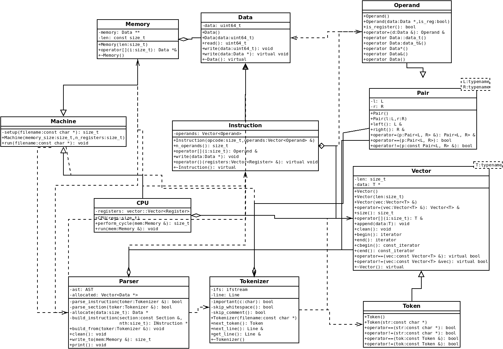

# NEUMANN-MODELL

## [(eredeti forráskód itt)](https://github.com/mhlyv/von-neumann)

## UML diagram


## A főprogram futása (a részletek elkerülésével)
- A főprogram értelmezi a parancssori paramétereket:
	- `--memory <szám>` a gép memóriájának mérete (default: 1000)
	- `--registers <szám>` a gép regisztereinek száma (default: 10)
	- a futtatni kívánt program forráskódjának fájlneve (kötelező)
- A főprogram készít egy gépet (machine::Machine) a megadott paraméterekkel.
- A főprogram megadja a futtatni kívánt program forráskódjának fájlnevét
a gépnek.
- A gép készít egy *tokenizáló*t (lang::Tokenizer), amelynek beadja
a futtatni kívánt program forráskódjának fájlnevét. A *tokenizáló*
feladata hogy a fájlból úgy olvasson hogy *token*ekre (lang::Token) bontja
a beolvasott sorokat (pl.: insturkció név, instrukció argumentum).
- A gép készít egy *parser*t (lang::Parser), amelynek beadja az előbb
elkészített *tokenizáló*t. A *parser* feladata, hogy a beérkező
*token*ekből értelmezze a forráskód szintaktikáját, és AST-t (abstract
syntax tree) építsen. Itt a parser értelmezi a szekciókat, címkéket és 
instrukciókat.
- A gép meghívja a *parser.write_to()* tagfüggvényt, amely az AST-alapján
létrehozza az *instruckció* (inst::Instruction) objektumokat, és beírja
ezeket a paraméterként megadott memóriába (memory::Memory), és visszaadja
az írt instrukciók számát. Az instrukciók előállítása közben adódó
allokációkat a *parser* eltárolja, és miután végzett az instrukciók
memóriába írásával, újralátogatja az `"exit"` instrukciókat, és
mindegyiknek beadja az allokált memóriákat paraméterként, így a program
futásának végén az exit instrukció felszabadítja ezeket, így kerülve a
memóriaszivárgást. A *parser* felelős az instrukciók paramétereinek
értelmezéséért is:
	- `"<címke>"` ==> az adott címke instrukcióindexe
	- `"r<szám>"` ==> a processzor `<szám>`-adik regisztere (`"r0"` mindig a
	program-counter, `"r1"` mindig a stack-pointer)
	- `"<szám>"` ==> számérték (bináris/decimális/hexadecimális)
- Ez után a gép kiadja a parancsot a CPU-nak (cpu::CPU), hogy futtassa
a paraméterként megadott memóriában található programot. Ennek az rendje
hogy a CPU kiolvassa a memóriából a soron következő instrukciót (a 0.
regiszter, azaz *program-counter*) alapján, aztán inkrementálja a
*program-counter*t majd végrehajtja az instrukciót, úgy hogy annak
hozzáférést ad a regiszterekhez (azért az instrukció előtt inkrementál,
mert ha az instrukció ugrást végez, így utólag nem módosítja a *pc*-t),
majd ellenőrzi az instrukció kódját, és ha egy `"exit"` instrukciót
hajtott végre akkor nem folytatja a végrehajtást.
- Miután a CPU befejezte a végrehajtást, a gép felszabadítja a memóriában
foglalt instrukciókat.
- Ezek után a főprogram sikeresen kilép, és a destruktorok gondoskodnak
az egyéb allokációk kezeléséről.

## Programozás

### Szintaktika
Körülbelül így néz ki egy program:
```
section .text
	<instrukció> <paraméterek>
<címke>:
	<instrukció> <paraméterek>
	<instrukció> <paraméterek>
	...
```

Szintaktikailag más *szekciókat* is létre lehet hozni a `"section <név>"`
szintaktikával, de ezek figyelmen kívül vannak hagyva. Ezen kívül fontos a
paraméterek szintaktikája is:

- Vesszővel vannak elválasztva.
- Nem tartalmaznak szóközt.
- Ezek közül az egyik igaz rájuk:
	- Egy címke neve.
	- Egy regiszter neve (`"r<szám>"`).
	- Egy számérték:
		- bináris (pl.: `"0b101010`")
		- decimális (pl.: `"123456789"`)
		- hexadecimális (pl.: `"0xDEADBEEF"`)

### Instrukciós készlet
- `"exit"`: Megszünteti az instrukciók végrehajtását, felszabadítja a
feleslegessé vált memóriát.
- `"move"`: Az első paraméterbe másolja a második paramétert
- `"add"`: Összeadja a paramétereket és bemásolja az eredményt az első
paraméterbe.
- `"sub"`: Kivonja az első paraméterből az utánna lévő paramétereket és az
eredmény bemásolja az első paraméterbe.
- `"mult"`: Összeszorozza a paramétereket és az eredmént bemásolja az első
paraméterbe.
- `"div"`: Elosztja az első paraméter az utánna lévő paraméterekkel és az
eredményt bemásolja az első paraméterbe.
- `"shl"`: Az első paraméteren bal bitshift-et hajt végre a második paraméter
értékével.
- `"shr"`: Az első paraméteren jobb bitshift-et hajt végre a második paraméter
értékével.
- `"and"`: Logikai *és*-t hajt végre a paramétereken és az eredményt bemásolja
az első paraméterbe.
- `"or"`: Logikai *vagy*-ot hajt végre a paramétereken és az eredményt
bemásolja az első paraméterbe.
- `"xor"`: Logikai *kizáró vagy*-ot hajt végre a paramétereken és az eredményt
bemásolja az első paraméterbe.
- `"not"`: Logikai negációt végez az első paraméteren.
- `"print"`: Szóközzel elválasztva kiírja a paraméterek értékét.
- `"jmpz"`: Ha az első paraméter értéke 0, akkor az instrukció után a
végrehajtás a második paraméterben megadott helyen folytatódik.
- `"relz"`: Ugyan az mint a `"jmpz"`, csak az intrukcióhoz képest ugrik előre
vagy hátra (lásd examples/relative\_jump.s).
- `"jmpnz"`: Ha az első paraméter értéke nem 0, akkor az instrukció után a
végrehajtás a második paraméterben megadott helyen folytatódik.
- `"relnz"`: Ugyan az mint a `"jmpnz"`, csak az intrukcióhoz képest ugrik előre
vagy hátra (lásd examples/relative\_jump.s).
- `"swap"`: Kicseréli az első és a második paraméter értékét.
- `"push"`: Az első paraméter másolatár beírja a memória (stack) következő
helyére.
- `"pop"`: Kimásolja az első paraméterbe a memória (stack) legfelső elemét,
és kitöri a memóriából az értéket.
- `"call"`: Meghív egy szubrutint.
- `"ret"`: Visszatér egy szubrutinból.

## Tesztelés
- A fontos, kisebb elemeket unit tesztek segítégével teszteltem, ezek
forráskódja a az eredeti repository-ban a `src/test/` mappában van, a
jportán ha beadom akkor `test_...` nevű fájlok. Ezek az eredeti
fordítási rendszeremben egy külön futtatható programfájlba fordulnak,
de csak a *debug* fordítási célban (ennek belépési pontja a
`src/test/test.cpp` fájlban található). A jportára leadott
forráskódban ez nem lesz, hanem csak a rendes főprogram lesz az egyetlen
futtatható fordítási egység (ennek belépési pontja a `src/main.cpp`
fájlban található).
- A memóriaszivárgások elkerülését a valgrind eszközzel és az
AddressSanitizer használatával biztosítottam, az eredeti fordítási
rendszeremben a *debug* fordítási célban minden az `-fsanitize=address`
flag-gel van fordítva. A `"push"`/`"pop"` instrukciók használata
nincs ellenőrizve, ha a futtatott program nem üríti ki helyesen a `stack`-et,
akkor memóriaszivárgás lesz, ha pedig többször `pop`-ol mint `push`-ol, akkor
pedig érhető módon más problémákat fog okozni.

## Osztályok és függvények dokumentációja

### Data (`src/memory/memory.h`)

```
// Egy elemi adat tárolására alkalmas osztály.
class Data {
public:
	// A tárolt adat típusa.
	typedef uint64_t data_t;
private:
	// A konkrét tárolt adat.
	data_t data;
public:
	Data();
	Data(data_t data);

	// Kiolvassa az értéket.
	data_t read() const;

	// Írja az értéket.
	void write(data_t data);


	// Ezek arra kellenek hogy lehessen úgy használni az objektumot mint
	// a tárolt adatot, így nem kell újra megvalósítani a különböző
	// aritmetikai/logikai műveleteket tagfüggvényként.
	operator data_t&();
	operator data_t() const;

	// Másolja a megadott értéket.
	virtual void write(Data *data);

	// Lesz leszármazottja, így virtuális a destruktor.
	virtual ~Data();
};
```

### Memory (`src/memory/memory.h`)
```
// Elemi adatok, és annak leszármazottjainak tárolására alkalmas osztály.
class Memory {
private:
	// Dinamukusan foglalt tömb, azért Data **, hogy ne csak Data-t, hanem
	// annak leszármazottjait is tudja tárolni.
	Data **memory;

	// A memória mérete (darab).
	const size_t len;
public:
	// Lefoglalja a tömböt az adott mérettel, és kinullázza az elemeket.
	Memory(size_t len);

	// Indexelő operátor, visszaad egy referenciát az adott indexű elemre
	// a tömbben. Hibás index esetén kivételt dob.
	Data *&operator[](size_t i);

	// Felszabadítja a memória tömböt, viszont azzal nem foglalkozik
	// hogy a benne lévő elemeket fel kell e szabadítani.
	~Memory();
};
```

### Vector (`src/vector/vector.hpp`)
```
// Egy adattípusú elemek tárolására alkalmas osztály.
// Csak feltölteni lehet, mert a felhasználásában sehol nincs szükség
// elemek törlésére.
template<typename T>
class Vector {
private:
	// A tárolt adatok aktuális száma.
	size_t length;

	// A tárolt adatok dinamikusan foglalt tömbje.
	T *data;
public:
	// Iterátorok a lista tömb elemein való lépkedéshez.
	typedef T* iterator;
	typedef const T* const_iterator;

	Vector();

	// Dinamikusan lefoglal egy adott méretű tömböt.
	Vector(size_t len);

	// Másoló konstruktorok, másolják a tömböket.
	Vector(Vector<T> &vec);
	Vector(const Vector<T> &vec);

	// Visszaadja a tömbben található elemek számát.
	size_t size() const;

	// Értékadó operátorok, másolják a tömböket.
	Vector<T> &operator=(Vector<T> &vec);
	Vector<T> &operator=(const Vector<T> &vec);

	// Indexelő operátorok, egy referenciát adnak vissza a kívánt elemre,
	// hibás index esetén kivételt dobnak.
	T& operator[](size_t i);
	const T& operator[](size_t i) const;

	// Iterátorok használatához tartozó függvények.
	iterator begin();
	iterator end();
	const_iterator cbegin() const;
	const_iterator cend() const;

	// A tömb végéhez hozzáfűzi az új elemet.
	void append(T d);

	// Felszabadítja a dinamikusan foglalt tömböt.
	void clean();

	// Összehasonlító operátorok (==/!= operátort használ).
	virtual bool operator==(const Vector<T> &vec) const;
	virtual bool operator!=(const Vector<T> &vec) const;

	// A destruktor virtuális, mert lesz leszármazottja.
	virtual ~Vector();
};
```

### Pair (`src/pair/pair.hpp`)
```
// Két különböző adattípus tárolására alkalmas osztály. Az adatok úgy
// vannak elnevezve hogy jobb és bal oldali.
template<typename L, typename R>
class Pair {
private:
	// Az egyik típusú érték.
	L left_val;

	// A másik típusú érték.
	R right_val;
public:
	Pair();

	// Beállítja a jobb és bal oldali adatok értékét.
	Pair(L l, R r);

	// Hozzáférés a bal oldali adathoz.
	L &left();
	const L &left() const;

	// Hozzáférés a jobb oldali adathoz.
	R &right();
	const R &right() const;

	// Összehasonlító operátorok (==/!= operátort használ).
	bool operator==(const Pair<L, R> &p) const;
	bool operator!=(const Pair<L, R> &p) const;
};
```

### Operand (`src/instruction/instruction.h`)
```
// Instrukció paramétere, két típusa lehet, az értéke vagy egy regisztert,
// vagy csak magát az értéket jelenti.
class Operand : public pair::Pair<memory::Data *, bool> {
public:
	Operand();

	// Beállítja az adatot és azt hogy az egy regiszter-e.
	Operand(memory::Data *data, bool is_reg);

	// Visszaadja hogy egy regisztert jelent-e.
	bool is_register() const;

	// Értékadó operátor.
	Operand &operator=(memory::Data &d);

	// Operátorok hogy lehessen közvetlenül úgy használni, mint a tárolt
	// adat adattípusát.
	operator memory::Data::data_t&();
	operator memory::Data::data_t() const;

	// Operátorok, hogy lehessen úgy használni mint a tárolt adatot.
	operator memory::Data*();
	operator memory::Data&();
	operator memory::Data() const;
};
```

### Instruction (`src/instruction/instruction.h`)
```
// Egy instrukció osztálya, lényegében egy functor. A Data osztályból van
// származtatva, így tárolható Memory-ban.
class Instruction : public memory::Data {
protected:
	// Az instrukció paramétereinek listája.
	vector::Vector<Operand> operands;
public:
	// Inicializálja az ősosztályt az opcode-al, és a paramétereit.
	Instruction(size_t opcode, vector::Vector<Operand> &operands);

	// Visszaadja hogy hány paramétere van.
	size_t n_operands() const;

	// Indexelő operátor, az adott paraméter referenciáját adja vissza,
	// hibás index esetén kivételt dob.
	Operand &operator[](size_t i);

	// Másolja az adott adatot.
	void write(memory::Data *data);

	// Végrehajtja az instrukciót, szüksége van a regiszterekre.
	virtual void operator()(vector::Vector<Register> &registers);

	// Ebből lesznek leszármaztatva az instrukciós készlet elemei, ezért
	// a destruktor virtuális.
	virtual ~Instruction();
};
```

### Token (`src/lang/token.h`)
```
// Egy string tárolására alkalmas osztály.
class Token : public vector::Vector<char> {
public:
	Token();

	// Másolja az adott stringet.
	Token(const char *str);

	// Összehasonlító operátorok.
	bool operator==(const char *str) const;
	bool operator!=(const char *str) const;
	bool operator==(const Token &tok) const;
	bool operator!=(const Token &tok) const;
};

// Inserter, így kiírhatók mint string.
std::ostream &operator<<(std::ostream &os, const Token &tok);
```

### Tokenizer (`src/lang/tokenizer.h`)
```
// Tokenizáló, egy fájlból olvas tokeneket soronként.
class Tokenizer {
public:
	// Egy sornyi tokent tárol, és az adott sor számát.
	typedef pair::Pair<size_t, vector::Vector<Token>> Line;
private:
	// A stream amiből olvassa a tokeneket.
	std::ifstream ifs;

	// Az adott sor tokenjei.
	Line line;

	// Visszaadja hogy egy adott karakter fontos-e a tokenizáció
	// szempontjából (pl.: vessző, kettőspont stb).
	bool important(char c) const;

	// Átugorja a stream elején lévő nem fontos whitespace karaktereket,
	// és visszaadja hogy átlépett-e valamit.
	bool skip_whitespace();

	// Átugorja a stream elején lévő kommentet, és visszaadja hogy
	// átlépett-e valamit.
	bool skip_comment();
public:
	// Megnyitja az adott fájlnevű fájlt olvasásra.
	Tokenizer(const char *filename);

	// Kiolvassa és visszaadja a stream következő tokenjét.
	Token next_token();

	// Kiolvassa és visszaadja a stream következő sorját.
	Line &next_line();

	// Visszaadja az aktuális sort.
	Line &get_line();

	~Tokenizer();
};
```

### Parser (`src/parser/parser.h`)
```
// Egy tokenizálóból olvasott sorokat értelmező osztály. Az olvasott
// sorokból AST-t épít, majd ebből előállítja a valódi instrukciókat
// és ezeket beírja egy Memory-ba.
class Parser {
private:
	// Az olvasott Token-ekből létrehozott AST (abstract syntax tree).
	// Ez a típus typedef-elve van, az eddig említett osztályokból van
	// összeállítva, a részletesebb leírása az `src/parser/parser.h`-ban
	// található.
	AST ast;

	// A tokenek értelmezése közben szükséges adatallokációk listája.
	vector::Vector<memory::Data *> allocated;

	// Olvas, értelmez egy instrukciót a tokenizálóból, ezt beírja az
	// AST-be, és visszaadja hogy a token stream-nek vége van-e.
	bool parse_instruction(Tokenizer &toker);

	// Olvas, értelmez egy szekciót a tokenizálóból, ezt beírja az
	// AST-be, és visszaadja hogy a token stream-nek vége van-e.
	bool parse_section(Tokenizer &toker);

	// Dinamikusan foglal az adott adatnak memóriát, ezt hozzádja
	// az allokációk listájához majd visszaadja a foglalt adatot.
	memory::Data *allocate(size_t data);

	// Egy valódi instrukciót épít az adott szekció adott instrukciójából.
	inst::Instruction *build_instruction(const Section &section, size_t nth);
public:
	// Felépíti az AST-t az adott tokenizálóból olvasott adatokból.
	void build_from(Tokenizer &toker);

	// Törli az AST-t.
	void clean();

	// Kiírja az AST-ból készített programot az adott memóriába.
	size_t write_to(memory::Memory &mem);

	// Formázva kiírja az AST-t stdout-ra.
	void print() const;
};
```

### CPU (`src/cpu/cpu.h`)
```
class CPU {
private:
	// A cpu regiszterei.
	// [0]: a program counter (hányadik instrukciónál tart)
	// [1]: a stack pointer (a stack tetején lévő elem címe)
	// ...: általános célú regiszterek.
	vector::Vector<Register> registers;
public:
	// Létrehozza az adott darab regisztert.
	CPU(size_t regs);

	// Beállítja a stack pointer regiszter értékét az adott értékre
	void set_sp(Register sp);

	// Végrehajtja a program counter regiszter alapján a soron következő
	// instrukciót, inkrementálja a program counter-t, és visszaadja a
	// végrehajtott instrukció opcode-ját.
	size_t perform_cycle(memory::Memory &mem);

	// Végrehajtja a memóriában található instrukciókat. Ha egy "exit"
	// instrukció volt végrehajtja akkor befejezi a végrehajtást.
	void run(memory::Memory &mem);
};
```

### Machine (`src/machine/machine.h`)
```
// Egy Neumann számítógépet modellező osztály.
class Machine : public cpu::CPU, public memory::Memory {
private:
	// Kiolvassa és betölti az adott fájlban található programot a memóriába.
	size_t setup(const char *filename);
public:
	// Inicializálja a CPU-t, és a memóriát az adott paraméterekkel.
	Machine(size_t memory_size, size_t n_registers);

	// Végrehajtja az adott fájlban található programot.
	void run(const char *filename);
};
```
