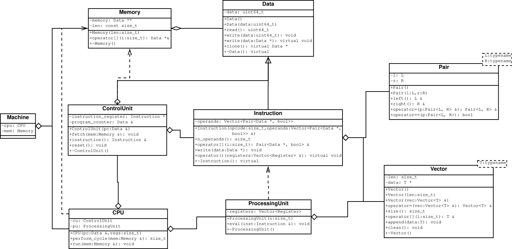

# Von-Neumann modell
## [(repo link)](https://github.com/mhlyv/von-neumann)

### Memória modell:
- A **Memory** osztály **Data** és **Instruction** objektumokat tárol.
- Az **Instruction** osztály egy **Vector**-ban tárol **Operand**
operandusokat, ezen kívül az **Instruction** őseinek lehetnek extra
adattagjai, pl.: a **control unit** program counter-éhez közvetlen hozzáféréshez.
- Az **Operand** egy egy **Data** és egy **bool** elemet tartalmaz,
a **bool** azt jelzi hogy a **Data** egy regisztert jelent-e.

### ControlUnit:
- A *fetch* tagfüggvény kiolvassa a memóriából az aktuális
**program_counter** indexnél található instrukciót az **instruction_register**-be.
- Az *instruction* tagfüggvény visszaadja az **instruction_register** tartalmát.

### ProcessingUnit:
- A regiszterek tartalma csak inne érhető el, mikor az *eval*
tagfüggvény hozzáférést ad az aktuális instrukció evaluációjakor.

### CPU:
- A *perform_cycle* tagfüggvény végrehajtja a következő instrukciót,
és visszaadja a végrehajtott instrukció opcode-ját.
- A *run* tagfüggvény ismételten meghívja a *perform_cycle*-t egész
addig amíg el nem érjük az **exit_opcode** kódú instrukciót.

### Machine:
- Még nincs kész.
- Egy **CPU**-t és egy **Memory**-t tartalmaz.

### Instrukciós készlet:
- Még nincs kész.
- Tervezett kategóriák:
	+ Alapvető aritmetikai operációk regiszterek és literal értékek között.
	+ Feltételes ugrások (**program_counter** változtatása).
	+ Stack operációk (pl.: push, pop) regiszterek és literal értékek között.
	+ I/O.
	+ Exit instrukció, ami felszabadítja, hogy a program beolvasásakor lefoglalt
	memóriát (a többi instrukció nem foglalhatnak új memóriát).
